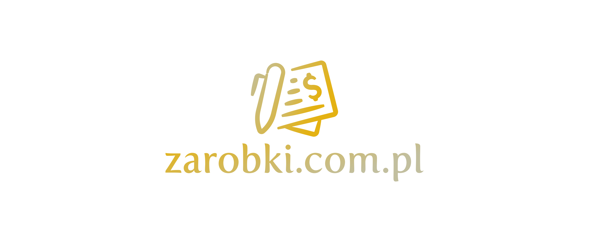

# https://zarobki.com.pl

# Font

Font in use <a target="_blank" href="https://www.fontspring.com/fonts/exljbris/fertigo-pro/fertigo-pro-regular">Fertigo_PRO</a> designed by
<a target="_blank" href="https://www.exljbris.com/">Exljbris</a>
and licensed under
<a target="_blank" href="https://www.fontsquirrel.com/license/fertigo-pro">Custom EULA.</a>
  Icon Designed by
  <a target="_blank" href="https://thenounproject.com/grega.cresnar">Gregor Cresnar</a>

# Colors

## Font
  
    #E4B213, #C2BF9F

## Background

    transparent

## Icon

    #C2BF9F, #E4B213
    
# Html
https://www.fontspring.com/fonts/exljbris/fertigo-pro/fertigo-pro-regular

### css 
    p {
       font-family: 'HKGroteskRegular';
       font-weight: normal;
       font-style: normal;
    }

### html

    <link rel="stylesheet" media="screen" href="https://fontlibrary.org/face/hk-grotesk" type="text/css"/>
    
    
# Logo

## 1

## 2

